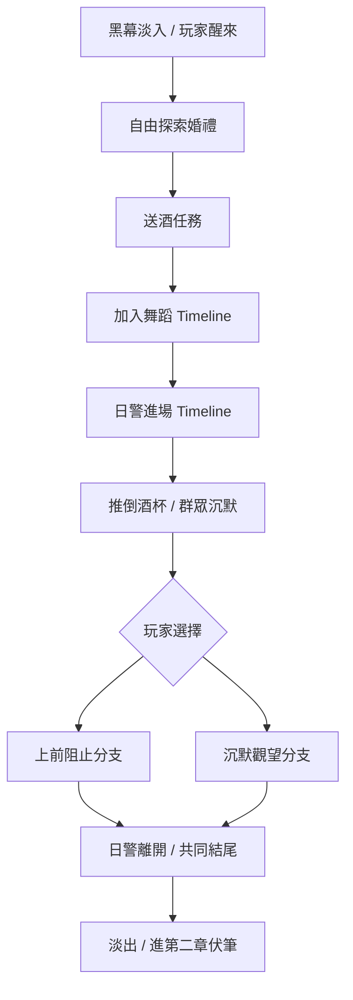

# 第一章：婚禮與導火線 Unity 演出計畫

## 演出定位
玩家先進入熱鬧婚禮，透過送酒、分享食物、加入舞蹈理解族人生活；接著日警進場打斷婚禮，情緒轉為壓迫與憤怒，最後用玩家選擇導向共同結尾。

## 建議流程

## 敏感橋段處理建議
原稿中日警對女性族人的羞辱不建議直接演出露骨畫面。建議用以下方式：鏡頭轉向火堆、族人表情、手部後退、酒杯落地、突然停止的鼓聲，讓玩家理解壓迫感，同時避免不必要的刺激與獵奇。

## Timeline Track 建議
- Cinemachine Track：開場第一人稱、舞蹈環繞、日警低角度進場、結尾背影遠景。
- Animation Track：族人跳舞、日警走入、推桌、族人後退、玩家分支動作。
- Audio Track：婚禮音樂、環境笑聲、靴子聲、低鼓、黑幕槍聲或衝突聲。
- Signal Track：鎖玩家控制、顯示字幕、顯示選項、分支合流、淡出。
- UI Track：互動提示、對話字幕、選項 UI。

## 第一優先要做
1. 先做婚禮場景 Blockout：火堆、舞圈、酒桌、山路入口。
2. 放入 8 位族人 NPC、2 位日警、1 位新郎。
3. 做三段 Timeline：舞蹈、日警進場、章節結尾。
4. 先完成一條主線流程，再補可選互動和分支細節。
